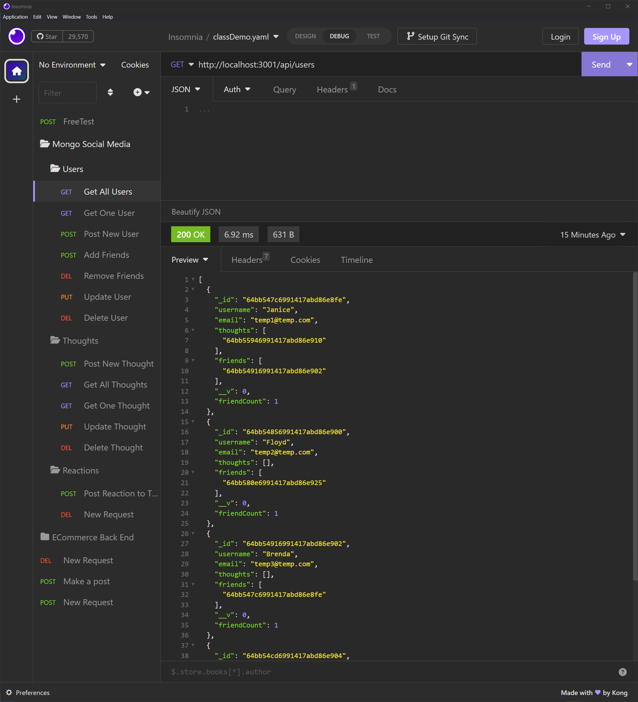

# The Mongo Mambo (Social Media Backend)

### Video Walkthrough: https://youtu.be/b9eK5oT7A3Q

## Table of Contents

- [Description](#description)
- [Installation](#installation)
- [Questions](#questions)
- [License](#license)

## Description

This is a backend for a hypothetical social media website that I wrote for a full stack web dev bootcamp. It uses Mongo for the database and implements a RESTful interface so that it could be easily integrated into the front end of an application

## Installation

To install, simply download the repo, execute npm i, and use something like Insomnia to send commands

## Questions

You can contact me with questions in the following places: 

Github Profile: https://github.com/TrueWillB 

## License

This repo and all of its contents operate under MIT License. For details, please view the LICENSE file in the repository or click the badge: 
